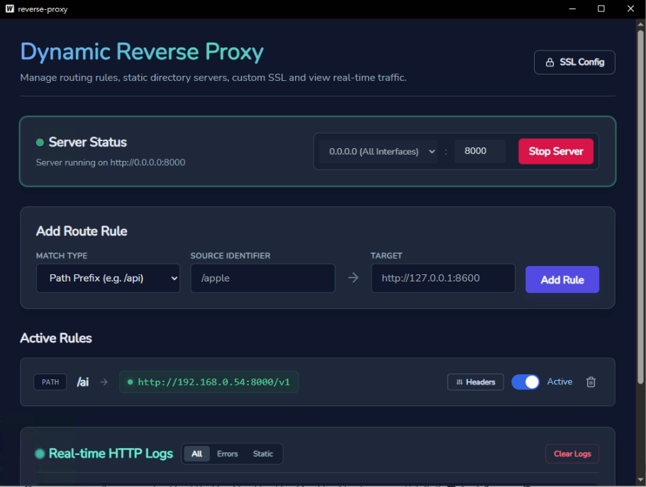
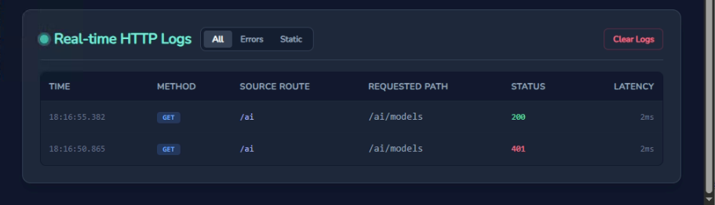

# Custom Reverse Proxy & Developer Server / 自訂反向代理與前端開發伺服器

Bilingual project documentation for a modern, lightweight reverse proxy server built using **Wails v2 (Go + Vue 3)**.

本專案是一個基於 **Wails v2 (Go + Vue 3)** 開發的現代化輕量級反向代理伺服器與靜態網頁伺服器，專為開發人員解決本地跨域、靜態網站託管與多服務整合需求。

<p align="center">
  
</p>
<p align="center">
  
</p>

---

## 🚀 Features / 功能特點

### 🌐 Routing & Proxying / 路由與代理轉發
* **Domain Routing (Host-based) / 網域名稱路由**: Route requests by hostname (e.g., `banana.local` -> `127.0.0.1:8080`).
  * 根據網域名稱進行轉發，輕鬆配置本機虛擬主機（e.g., `banana.local` -> `127.0.0.1:8080`）。
* **Path Routing / 路徑前綴路由**: Route requests by URL path prefix (e.g., `/api` -> `127.0.0.1:9000/api`) with auto-strip option.
  * 根據路徑前綴將流量轉發至不同後端服務（如 `/api` -> `127.0.0.1:9000`），支援自動修正 Cookie 路徑與 Location 轉址標頭。
* **Static Directory Serving / 靜態目錄託管**: Serve local folders as static websites (e.g., hosting your SPA app built with Vue/React).
  * 直接將本機目錄作為網頁伺服器執行，並支援 **SPA Fallback (Single Page Application)** 路由機制（自動將未找到的 HTML 請求導向 `index.html`）。

### 🛠️ Developer Tools / 開發輔助功能
* **Auto-CORS Injection / 自動跨域注入**: Automatically injection of CORS headers (`Access-Control-Allow-Origin: *`) to solve frontend local development issues.
  * 自動攔截並答覆 `OPTIONS` 預檢請求，並在響應中注入 CORS 標頭，徹底解決開發時前端請求後端發生的跨域問題。
* **WebSocket & SSE Support / 支援 WebSocket 與串流**: Transparently proxy WebSocket connections and Server-Sent Events (SSE).
  * 完美支援 WebSocket 雙向連線協議（自動進行連線升級）與 Server-Sent Events 伺服器發送事件流。
* **Live Traffic Monitor / 即時請求日誌**: Capture, inspect, and analyze incoming HTTP requests (headers, body up to 8KB, latency, status codes) streaming directly to the UI.
  * 即時錄製所有代理流量，前端介面可直接檢視詳細的 HTTP 請求頭、請求體、響應頭、響應體（大於 8KB 或二進位串流將自動截斷/跳過）以及連線延遲 (Latency)。
* **Health Check Monitor / 後端健康檢查**: Automatically check the status of backend servers and static folder existence every 30 seconds.
  * 每 30 秒自動在背景對所有啟用的代理路徑與目錄進行健康檢查，並將連線健康狀態即時回饋至 UI 介面。
* **Dynamic SSL/TLS Certificate Reloading / 動態 HTTPS 憑證重載**: Configure custom PEM certificates or fall back to an auto-generated self-signed certificate dynamically.
  * 支援設定並隨時重載自訂的 SSL/TLS 憑證；若無設定憑證，伺服器在啟用 HTTPS 時會自動動態產生自簽憑證（Self-Signed Certificate）以支援本地安全加密通訊。

---

## 📂 Project Structure / 專案結構

```
ReverseProxy/
├── backend/                  # Go Backend modules / Go 後端程式碼
│   └── proxy/                # Core Proxy logic / 代理伺服器核心
│       ├── config.go         # Configuration manager (proxy_config.json) / 全域憑證設定
│       ├── engine.go         # Core HTTP/HTTPS proxy engine / 反向代理引擎與日誌記錄
│       ├── log_manager.go    # In-memory traffic ring buffer / 記憶體流量日誌管理
│       └── manager.go        # Route rules registry & Health checks / 路由清單與健康檢查
├── frontend/                 # Vue 3 Frontend UI / Vue 3 前端介面
│   ├── src/                  # Components, styles, API interfaces / 組件與頁面邏輯
│   ├── wailsjs/              # Auto-generated JS bindings / Wails 自動生成的 Go-JS 綁定
│   └── package.json          # Node dependencies / 前端套件定義
├── build/                    # App icons & installer assets / 軟體安裝包與圖示資源
├── wails.json                # Wails configuration / Wails 設定檔
├── main.go                   # Go application entrypoint / Go 程式啟動進入點
└── app.go                    # Application lifecycle & Bridge APIs / 視窗生命週期與 API 橋接
```

---

## 🛠️ How to Run / 如何在本機開發與打包

### Prerequisites / 事前準備
1. **Install Go / 安裝 Go**: Make sure Go (v1.20+) is installed on your computer.
2. **Install Node.js / 安裝 Node.js**: Ensure Node.js and npm are installed for building the frontend.
3. **Install Wails CLI / 安裝 Wails 工具**: Install Wails command line tool manually:
   ```bash
   go install github.com/wailsapp/wails/v2/cmd/wails@latest
   ```

### 1. Run in Live Development Mode / 啟動開發環境
This will launch a desktop window with hot-reloading for both Go code and frontend code.
執行以下指令會啟動帶有即時熱重載（Hot Reload）的桌面視窗開發環境：
```bash
wails dev
```

### 2. Build for Production / 打包生產版本
Compile and package the application into a standalone native application (e.g., `.exe` for Windows).
編譯並將程式打包為各平台的獨立原生安裝檔（如 Windows 下的單一執行檔）：
```bash
wails build
```

---

## 📜 License / 授權條款

This project is licensed under the **MIT License**. For more details, see the [LICENSE](file:///d:/ReverseProxy/LICENSE) file.

本專案採用 **MIT 授權條款** 開源，詳情請參閱 [LICENSE](file:///d:/ReverseProxy/LICENSE) 檔案。
